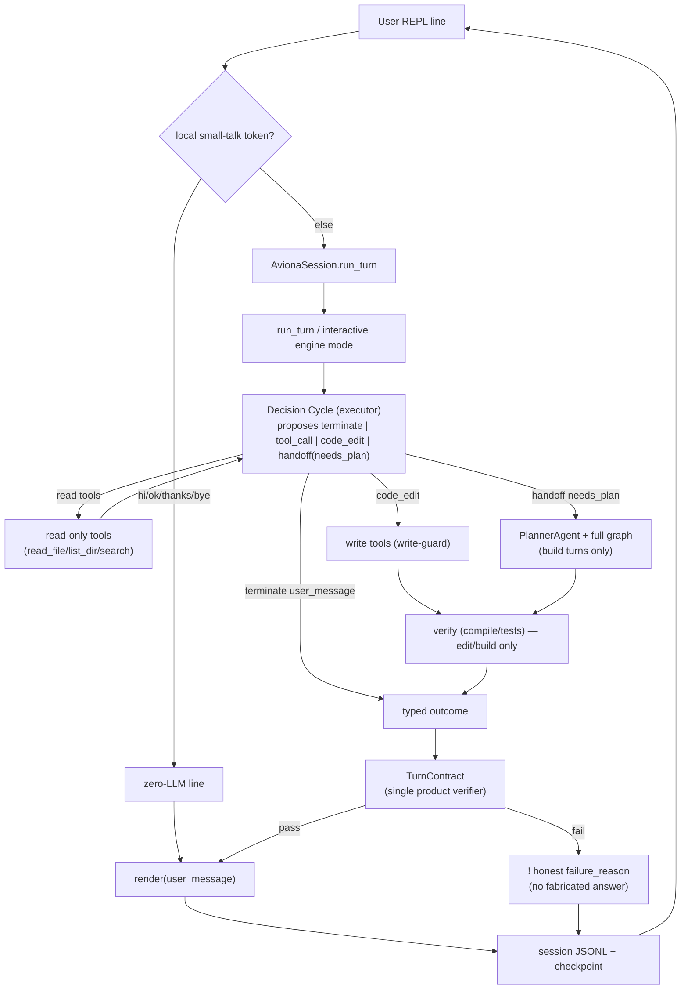

# Aviona — Architectural Replan (v2)

**Scope:** plan only, no code. Replaces the 0.2.x patch cycle (regex classification, deterministic
fallbacks, dual verification, auto-revert, scraped REPL detail) with a structural fix. Targets the live
failures in `D:/thesis/aviona-test`, keeps the thesis engine load-bearing, and keeps `eval/` frozen.

---

## 1. Executive summary

**Root cause.** The thesis engine is a *closed-loop file-editing task runner*: success = "a Python verifier
(tests/compile) passes against files in the workspace," and its only output, `SessionOutcome`, describes
**workspace** state — it has **no field for what to say to the user**. Aviona is a *conversational assistant*
whose unit of success is "the user got a correct, relevant reply, which may or may not involve editing files."
Bolting the second onto the first creates three unavoidable defects: (a) the success criteria diverge — the
engine can return `solved` while the user got nothing useful, or it edits a file nobody asked for and the
*Aviona* verifier flags it only *after* the side effect; (b) the user-visible answer must be **reconstructed**
by scraping `terminate` rationale, tool outputs, and the decision log, because the agent was never asked to
produce it; and (c) every utterance — `ok`, `what model are you?`, `salam` — pays for a full planner+executor
LangGraph run (up to 15 steps, 3–10k tokens). The 0.2.x patches (`classify_goal`, `[AVIONA *]` hints,
README/`read_file` fallbacks, `analyze_turn_effects`, auto-revert) are five reconciliation layers that try to
guess intent and manufacture an answer after the fact. Mocked tests pass because they assert the *scrape*
logic; live fails because the *orchestration* is wrong. More regex is whack-a-mole.

**Recommended direction.** Three structural changes, all of which *strengthen* the eight thesis rules rather
than bypass them. (1) **A typed user-visible outcome contract**: the agent must end every turn with
`terminate{user_message: "<exact text the REPL shows>"}` — detail is *produced and stored in the decision
log*, never scraped. (2) **Turn-type orchestration with a cheap default**, where the *agent's own first
Decision-Cycle step* (not Python regex) decides whether the turn is answer-only, inspect (read-only tools), or
edit, and Python enforces the budget/permission/promotion for that declared type. (3) **One product verifier
("TurnContract")** aligned with what the REPL displays, replacing the framework-verifier-vs-`analyze_turn_effects`
duality and the auto-revert. Net effect: the user always sees either the agent's typed answer or an honest `!`
with a real reason; trivial turns cost one LLM call; and the regex/fallback/scrape stack is deleted.

---

## 2. Target architecture

### 2.0 Product definition (the keystone decision) — `[REQUIRES_USER_INPUT]`

Aviona is a **chat-first assistant that can edit files**, rooted in `cwd` — the Claude Code model. It is *not*
a batch file-editing agent that happens to have a prompt, and *not* a chat bot that can't touch the repo. In one
session it answers questions about itself and the repo, inspects files, and edits them; the **default turn is
cheap** (answer or a single read) and **editing is opt-in by the user's intent**. This resolves the identity
mismatch (prompts framed the agent as a "task worker"; users treat it as a REPL assistant). Everything below
follows from this definition; it must be signed off before implementation.

### 2.1 Turn types and the orchestration each uses

The turn type is **declared by the agent** in its first Decision-Cycle proposal (a typed field on the
proposal), then Python maps the declared type to a budget, a permission mode, and a verifier. The SLM proposes;
Python decides transitions and limits (rule 3 intact). Only one tiny fixed local bypass remains — exact
small-talk tokens the author already accepted.

| Turn type | Who decides | Execution path | Tools | Verifier (TurnContract) |
|-----------|-------------|----------------|-------|--------------------------|
| **local** (`hi`, `ok`, `thanks`, `bye`) | fixed token set (Python, ~6 literals) | zero-LLM canned line | none | non-empty line; no edits |
| **answer** (self/meta/general Q) | agent (cycle 1 → `terminate{user_message}`) | single executor cycle, no tools | none | non-empty `user_message`; no writes occurred |
| **inspect** (read a file, list, explain repo) | agent (cycle 1 requests read tools) | executor cycle(s), **read-only** | `read_file`, `list_dir`, `search_codebase` | `user_message` present; **no writes occurred** (write-guard) |
| **edit** (create/modify, single file) | agent (cycle 1 proposes `code_edit`) | executor loop + verify | file tools + compile/tests | edit applied **and** verify passed **and** `user_message` present |
| **build** (multi-file / multi-step) | agent emits typed `handoff{reason:"needs_plan"}` → Python promotes | full planner+executor graph (existing path) | full toolset | per-subtask verify + `user_message` |

Key point: the router is the **agent's typed output**, not `classify_goal` regex. Python never inspects the
phrasing to pick a path; it reads the agent's declared `turn_type` / `needs_plan` and applies the matching
budget and permission. "Answer directly vs use tools vs ask to plan" is exactly the decision a Decision Cycle
already makes — we just make the outcome **typed** and let it **terminate the turn**.

### 2.2 User-visible outcome contract

`terminate` gains a required typed `user_message: str`; `SessionOutcome` (and the Aviona `TurnResult`) carry it
through. Prompts (anchor-first, rule 6) instruct every agent to finish a turn with
`terminate{user_message, turn_type}`. The REPL prints `user_message` **verbatim**. There is no `pick_user_detail`,
no `_best_answer`, no tool-output scraping. If the agent cannot produce a `user_message` even after the Decision
Cycle's bounded corrective retries, the REPL shows an honest `! <failure_reason>` — it never fabricates an answer
or dumps a README.

### 2.3 Single verifier (TurnContract)

One product-level pass/fail, derived from the **typed** outcome and the declared turn type (table above) — no
second post-hoc analyzer. Read-only turns can't produce unsolicited edits because the **permission gate is set
read-only up front** from the declared type (write-guard enforces it at the tool level, rule 8), so the
auto-revert heuristic is deleted; snapshots/undo remain only as an explicit user feature (`aviona undo`).

### 2.4 Target flow

Transitions (`needs_plan` promotion, EVALUATE→DONE/REVISE) stay in Python (`next_state` / graph). The agent
contributes **data** (`turn_type`, `user_message`, `handoff.reason`), never the transition itself.

---

## 3. What to remove or shrink (deletion list)

| File / symbol | Action | Why |
|---------------|--------|-----|
| `effects.classify_goal` + all `_WRITE_GOAL/_READ_*/_EXPLAIN_GOAL/_PROJECT_QUESTION/_QUESTION_LIKE/_FILE_HINT` regexes | **Delete** | Turn typing moves to the agent's typed proposal |
| `effects.analyze_turn_effects` | **Delete** | Replaced by TurnContract over the typed outcome |
| `effects.pick_user_detail`, `_best_answer`, `_is_vacuous_answer`, `_VACUOUS_ANSWER` | **Delete** | Detail is the agent's typed `user_message`, not scraped |
| `effects.is_directory_listing` | **Delete** | Only existed to disambiguate scraped tool output |
| `effects.requested_reply_text`, `_REQUESTED_REPLY`, `is_open_question`, `is_project_question` | **Delete** | Verbatim-reply / question detection handled by the agent answering |
| `effects.infer_target_file` | **Delete** | Agent resolves targets via read tools |
| `effects.snapshot_files`, `changed_files` | **Keep**, relocate to `aviona/turn_io.py` | Factual file observations for the edit verifier + undo (not NLU) |
| `effects._collect_tool_paths`, `_path_from_payload` | **Keep**, relocate | Factual edit/read accounting for the edit-turn contract |
| `fallbacks.py` (entire module: `try_read_content_fallback`, `try_explain_fallback`, `build_project_summary`, `_first_paragraph`) | **Delete from product** | Permanent README/`read_file` fallbacks were rejected; agent reads files itself. (If kept at all, only as a hidden `--debug-fallbacks` dev flag, clearly temporary, never on by default.) |
| `session.py` `_AVIONA_EXECUTOR/READ/READ_CONTENT/EXPLAIN/QA/REPLY_HINT` strings + `goal_kind` hint injection | **Delete** | No more per-kind hint engineering; the contract lives in the standard prompt + typed schema |
| `session.py` reconciliation block: `turn_verifier.last_effects or analyze_turn_effects(...)`, fallback branch, force-`unresolvable`, auto-revert (`_REVERT_ON_FAILURE`, `undo_last` on failure), `_best_answer_from_entries`, `_decision_tool_text` | **Delete** | Single TurnContract + typed `user_message` replace all of it |
| `verify_turn.TurnOutcomeVerifier` | **Delete / fold** | Merge into the single TurnContract (or the framework verifier extension) |
| `JOURNEYS.md` per-phrase rows (J1–J9 phrasing matrix) | **Replace** | New contract matrix keyed on turn types + invariants, not phrasings |
| `runtime.runtime_anchor_segment` (provider/model/version facts) | **Keep** | This is the *correct* fix for "what model are you?" — the agent answers from typed anchor facts (rule 6), not a canned route or README |
| `snapshots.py`, `store.py`, `permissions.py`, `gitctx.py`, `render.py` | **Keep** (render simplified to print `user_message`) | Genuine product surface, not patches |

---

## 4. Phased roadmap — `ROADMAP_PRODUCTION_AVIONA_V2.md`

Commit style: `aviona-v2-N: <short description>`. Gates are mocked/`--dry-run` unless marked
`[REQUIRES_USER_INPUT]`. **Every framework change is additive and gated by the full thesis test suite as a
regression check so `eval/` stays frozen.**

### AVIONA-V2-0 — Baseline commit + product sign-off `[REQUIRES_USER_INPUT]`
**Goal:** Commit the uncommitted 0.2.0–0.2.6 work so the migration diff is clean and reversible, and record the
§2.0 product decision (chat-first edits) + the additive framework-contract decision.
**Tasks:** commit current tree on a `pre-v2` tag; write the product definition + turn taxonomy into `PROGRESS.md`
(`active_roadmap: ROADMAP_PRODUCTION_AVIONA_V2.md`, `aviona_track: v2`).
**Gate:** `git tag pre-v2` exists; `aviona --version` == recorded baseline; sign-off line in `PROGRESS.md`.
**Commit:** `aviona-v2-0: baseline tag + product definition sign-off`

### AVIONA-V2-1 — Typed user-message contract (framework, additive)
**Goal:** Give the engine a first-class user-visible result.
**Tasks:** add `user_message: str` and `turn_type: Literal[...]` to the `terminate` proposal schema
(`framework/control/models.py`) and `user_message: str = ""` to `SessionOutcome`
(`framework/orchestration/session.py`); update planner/executor prompt templates so every turn ends with
`terminate{user_message, turn_type}` (anchor-first). Benchmark mode leaves `user_message` empty — eval path
unchanged.
**Gate:** `pytest tests/unit/test_terminate_contract.py tests/integration/test_decision_cycle.py` and the full
thesis suite green (eval regression).
**Commit:** `aviona-v2-1: typed terminate.user_message + SessionOutcome.user_message`

### AVIONA-V2-2 — Interactive turn mode in the engine (framework, additive)
**Goal:** One cheap path that answers-or-acts and terminates on the first `user_message`, with Python promotion
to the planner only on demand.
**Tasks:** add `run_turn(...)` (or `run_full_session(interactive=True)`) that defaults `planner_enabled=False`,
runs the executor Decision Cycle, terminates on `terminate{user_message}`, and promotes to the planner/full
graph when the executor emits typed `handoff{reason:"needs_plan"}`; promotion is a Python transition in
`next_state`/the graph, not an SLM call.
**Gate:** `pytest tests/integration/test_interactive_turn.py` — chat goal terminates in 1 cycle; edit goal does
one write+verify; `needs_plan` promotes to planner; transitions remain Python.
**Commit:** `aviona-v2-2: interactive turn mode (planner-optional, needs_plan promotion)`

### AVIONA-V2-3 — Single TurnContract verifier
**Goal:** One product pass/fail aligned with what the REPL shows.
**Tasks:** `src/aviona/contract.py` — `verify_turn(turn_type, outcome, file_obs) -> TurnContractResult`
implementing the §2.1 table; read-only turns require zero writes (checked against the write ledger, not regex);
edit/build require verify passed. Delete `verify_turn.TurnOutcomeVerifier`.
**Gate:** `pytest tests/unit/test_aviona_contract.py` — answer/inspect/edit/build contracts; asserts the module
imports **no** `effects`/`fallbacks` symbols.
**Commit:** `aviona-v2-3: single TurnContract verifier (replaces dual verification)`

### AVIONA-V2-4 — Delete the patch stack; rewire the turn driver
**Goal:** Make `session.run_turn` thin again.
**Tasks:** delete `fallbacks.py`; delete the §3 symbols from `effects.py` (relocate the factual
`snapshot_files/changed_files/_collect_tool_paths` to `aviona/turn_io.py`); delete `_AVIONA_*` hints and the
reconciliation/fallback/force-unresolvable/auto-revert blocks from `session.py`; rewrite `run_turn` as: build
anchor (project rules + runtime facts + git) → `run_turn(interactive=True)` → `TurnContract` → `render(user_message)`
→ `store.append_turn`. Keep snapshots/undo as an explicit feature only.
**Gate:** `scripts/test-aviona.ps1` (L2) green **and** a grep gate: no references to `classify_goal`,
`analyze_turn_effects`, `try_*_fallback`, `_AVIONA_`, `_REVERT_ON_FAILURE`, `_best_answer` remain in `src/aviona/`.
**Commit:** `aviona-v2-4: delete regex/fallback/scrape stack; thin turn driver`

### AVIONA-V2-5 — Cost-aware budgets + read-only enforcement per turn type
**Goal:** Make trivial turns cheap and non-edit turns incapable of editing.
**Tasks:** map declared `turn_type` → step/token caps (§5) in `run_turn`; set permission mode read-only for
`answer`/`inspect`; `build` is the only path allowed up to 15 steps and only after `needs_plan`.
**Gate:** `pytest tests/unit/test_turn_budgets.py` — a mocked `answer` turn makes exactly **1** SLM call;
`inspect` ≤ 3 steps; read-only turn writing a file is **blocked** by the write-guard (no revert needed).
**Commit:** `aviona-v2-5: per-turn-type budgets + read-only enforcement`

### AVIONA-V2-6 — New acceptance matrix (L2 mocked) replacing JOURNEYS phrasings
**Goal:** Test invariants, not phrasings.
**Tasks:** `tests/unit/test_aviona_contract_matrix.py` driven by a small table of *(turn_type, mocked typed
terminate, expected contract result, budget)*; rewrite `JOURNEYS.md` into a contract matrix (turn types +
invariants: always a `user_message`; no unsolicited edits; budget cap per type).
**Gate:** `pytest tests/unit/test_aviona_contract_matrix.py`.
**Commit:** `aviona-v2-6: contract-based acceptance matrix (replaces phrasing journeys)`

### AVIONA-V2-7 — Runtime self-knowledge as anchor data (kills the model-question failures)
**Goal:** "what model are you?" answered correctly and cheaply.
**Tasks:** keep/extend `runtime.runtime_anchor_segment` so provider/model/version/cwd facts are in the anchor;
prompt instructs the agent to answer self-questions from those facts and `terminate{user_message}` in one cycle.
No canned route, no README.
**Gate:** `pytest tests/unit/test_runtime_answer.py` — given anchor facts, a mocked agent emits a `user_message`
containing the model id in 1 cycle; read-only.
**Commit:** `aviona-v2-7: runtime self-knowledge via anchor facts`

### AVIONA-V2-8 — Live journey gate (L3) `[REQUIRES_USER_INPUT]`
**Goal:** Lock the previously-failing prompts against real API before release.
**Tasks:** define the release-blocking live set (§6) in `scripts/test-aviona.ps1 -Live` against `aviona-test`;
assert correct `user_message` substring, no unsolicited edits, and within token/step budget for each.
**Gate:** `scripts/test-aviona.ps1 -Live` passes the locked set. `[REQUIRES_USER_INPUT]` — API budget + author
sign-off on expected answers.
**Commit:** `aviona-v2-8: locked live journey gate (L3)`

### AVIONA-V2-9 — Windows install hardening (carry-over)
**Goal:** Keep `pip install -e .` / `aviona.exe` robust through the migration.
**Tasks:** keep `scripts/install-aviona.ps1` handling corrupt `~*` dist-info and `aviona.exe` file locks; verify
`aviona --version` parity after reinstall.
**Gate:** install script dry-run + `aviona --version` match (no API).
**Commit:** `aviona-v2-9: windows install hardening`

### AVIONA-V2-10 — Docs + migration close-out
**Goal:** Leave the repo coherent.
**Tasks:** update `AVIONA_CURRENT_STATE.md` and the architecture doc to the v2 model; add a CHANGELOG entry
listing deletions; bump minor version (`0.3.0`).
**Gate:** docs updated; `PROGRESS.md` shows v2 track DONE through V2-10.
**Commit:** `aviona-v2-10: docs + v2 migration close-out (0.3.0)`

---

## 5. Token / step budgets per turn type

| Turn type | LLM cycles (cap) | Tools | Token target/turn | Full graph allowed? |
|-----------|------------------|-------|-------------------|---------------------|
| local | 0 | none | 0 | no |
| answer | 1 | none | ≤ ~0.8k | no |
| inspect | ≤ 3 | read-only | ≤ ~1.5k | no |
| edit (single file) | ≤ 6 | file + verify | ≤ ~3k | no |
| build (multi-file) | ≤ 15 | full | task-dependent | **yes, only after `needs_plan`** |

The full planner+executor graph (today's *only* path) is acceptable **only** for `build`. Hitting 3–10k tokens
on `ok`/`what model?` becomes structurally impossible because those resolve at `local`/`answer`.

---

## 6. Acceptance matrix

**L2 — mocked (CI, no key):** invariants over mocked typed terminates — every turn yields a non-empty
`user_message` or an honest `!`; no turn outside `edit`/`build` produces a file write; each turn type stays within
its cycle cap; deletion grep gate passes. Files: `test_aviona_contract.py`, `test_aviona_contract_matrix.py`,
`test_turn_budgets.py`, `test_runtime_answer.py`, plus existing `test_aviona_session/store/repl/...`.

**L3 — live (`aviona-test`, real key) — release-blocking set:**

| Prompt | Turn type | `user_message` must contain | Must NOT | Budget |
|--------|-----------|------------------------------|----------|--------|
| `hi` | local | a greeting | any LLM call, any edit | 0 cycles |
| `ok` | local | an acknowledgment | edit a file (`notes.txt`!) | 0 cycles |
| `what is your model?` | answer | provider + model id (from anchor) | README dump, edits | ≤ 1 cycle |
| `what language model?` | answer | model id | project overview, truncation | ≤ 1 cycle |
| `try to fastly reply with "salam"` | answer | `salam` | `ok` with empty detail | ≤ 1 cycle |
| `what is content of hello file?` | inspect | the file body (`hi`) | directory listing only, edits | ≤ 3 cycles |
| `what is this project` | inspect | a real summary from README/sources | vacuous meta, edits | ≤ 3 cycles |
| `list files in this dir` | inspect | file names | edits | ≤ 3 cycles |
| `create foo.txt with "x"` | edit | confirmation of the write | — | ≤ 6 cycles, verify passed |

All L3 rows assert: correct `user_message` substring, no unsolicited edits, within token/step budget. Failing
any row blocks release.

---

## 7. Framework vs Aviona-only changes

**Framework (additive; thesis suite is the regression gate; eval path unchanged):**
- `terminate.user_message` + `turn_type` on the proposal schema; `SessionOutcome.user_message` (V2-1).
- Interactive turn mode: planner-optional, terminate-on-`user_message`, Python `needs_plan` promotion (V2-2).
- Prompt templates instructing the typed terminate (anchor-first).
- *Note:* `run_full_session` was **already** extended in 0.2.x with `verifier`, `probe`, `permission_check`,
  `write_file_fn`, `edit_file_fn`, `effect_sink` — so the framework boundary is already crossed; v2 consolidates
  these into the interactive mode rather than adding more ad-hoc params.

**Aviona-only:** delete `effects` NLU + `fallbacks` + `_AVIONA_*` hints + `TurnOutcomeVerifier` + reconciliation
/auto-revert/scraping; add `contract.py` (single verifier) and `turn_io.py` (factual file observations); thin
`run_turn`; keep snapshots/undo, store, permissions, gitctx, runtime facts, render.

**Thesis-rule compliance:** the plan *strengthens* rules 1–8 — state stays in memory stores (the `user_message`
is a stored decision payload), messages become *more* typed (replacing untyped scraping), transitions stay
Python (agent supplies data, not transitions), every LLM call stays in the Decision Cycle, truncation/anchor/
append-only/write-guard are unchanged. The only philosophical shift is explicitly splitting **product mode**
(interactive turn, `user_message` contract) from **eval mode** (benchmark `test_code` verifier) on the same
engine — which the current state doc already anticipates.

---

## 8. Risks and open questions

1. **Framework-change blast radius.** Adding `user_message`/interactive mode touches the shared engine.
   *Mitigation:* additive + optional; the full thesis test suite runs as the gate on V2-1/V2-2; benchmark mode
   ignores `user_message`. **Open:** does the committee consider an interactive mode a thesis deviation, or
   purely a product layer? (record decision in V2-0).
2. **SLM reliability on the typed terminate.** Small models may not always emit a clean
   `terminate{user_message}`. *Mitigation:* the Decision Cycle's existing parser + quality gate + one bounded
   corrective retry; on exhaustion the REPL shows an honest `!` — **never** a scraped/fabricated answer.
   **Open:** acceptable retry budget for `answer` turns (1 vs 2) before `!`.
3. **Promotion signal design.** When should the executor emit `handoff{needs_plan}`? *Mitigation:* define a
   typed rule (e.g., the goal implies >1 file or the executor's own estimate). **Open:** the exact threshold;
   start conservative (single-file edits never promote).
4. **Residual Python intent.** Only the fixed small-talk literal set stays local. **Open:** is even that
   acceptable, or should `hi`/`ok` also go through a 1-call `answer` turn for consistency? (Recommend keep local
   for 0-token snappiness — already author-approved.)
5. **Mis-declared turn type.** If the agent says `answer` but tries to write, the read-only permission gate +
   write-guard block the write at the tool level — safe by construction, so no auto-revert is needed.
6. **Uncommitted 0.2.x baseline.** Deleting the patch stack before committing it would lose history.
   *Mitigation:* V2-0 tags `pre-v2` first.
