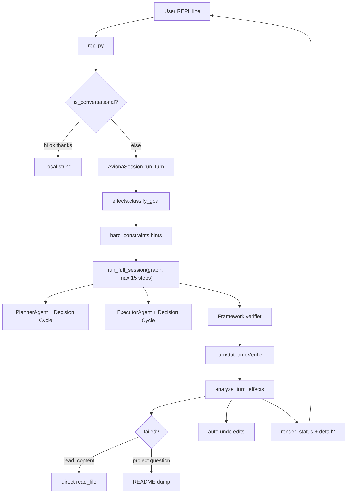

# Aviona — Architecture Issue Brief

**Audience:** External planner (Claude)  
**Companion:** `docs/AVIONA_CURRENT_STATE.md`, `docs/PROMPT_AVIONA_REPLAN.md`

---

## One-sentence problem

Aviona bolted a conversational REPL onto a multi-agent **file-editing benchmark engine** without a first-class **user-visible outcome** or **turn-type orchestration**, then patched UX gaps with regex classification, decision-log scraping, and deterministic fallbacks — mocked tests pass; **live REPL fails within minutes** at high token cost.

---

## Symptom → mechanism map

| User sees | Likely mechanism |
|-----------|------------------|
| `ok` but empty detail under status | `analyze_turn_effects` passes vacuously; `_best_answer` rejects short `<20 char` terminate text; REPL detail scraped post-hoc |
| `ok` + wrong content (README for model question) | `classify_goal` → `explain` + `try_explain_fallback` README dump |
| `!` after file edited on `ok` / chat | Full agent ran on non-write goal; edit happened before `TurnOutcomeVerifier` failed; revert added later |
| 3–10k tokens for trivial line | Every REPL line → full LangGraph session (planner + executor, up to 15 steps) |
| Working memory truncation warnings | `[SESSION CONTEXT]` + hints + anchor in `hard_constraints`; ceiling ~480–750 tokens on aviona-daily |
| 67 tests pass, user finds bugs | L2 is mocked SLM only; L3 live smoke is minimal; no locked live journey CI |

---

## Architectural mismatches

### 1. One orchestration path for all utterances

```
REPL line → run_full_session(graph) → Planner → Executor → N × Decision Cycle
```

Designed for: multi-step programming tasks with verification.

Used for: `salam`, `what model?`, `ok`, `list files`, `create foo.py`.

**Mismatch:** Cost and latency model is wrong for chat, Q&A, and single-shot replies.

### 2. Dual success criteria

| Layer | Decides |
|-------|---------|
| Framework | `SessionOutcome` (graph + `NoOpVerifier` / compile / tests) |
| Aviona | `TurnOutcomeVerifier` + `analyze_turn_effects()` (regex goal + file snapshots + log scrape) |

They diverge. Patches force `unresolvable` after inner `solved`, run fallbacks, or auto-undo — user sees inconsistent status (`ok` / `!` / `edited X`).

### 3. No typed user-visible result

Framework `SessionOutcome` has no `user_message` field.

Aviona reconstructs “detail” from:

- `effect_sink` tool outputs
- `terminate` payload/rationale heuristics
- `pick_user_detail()` / `_best_answer()`

The agent is never formally asked to produce **the string the REPL must show**.

### 4. Python regex as NLU

`effects.classify_goal()` drives hints, read-only mode, step budget, verification rules, and fallbacks.

Every new phrasing → new journey row + patch (`JOURNEYS.md` growth).

This does not scale and conflicts with user expectation (“just understand what I mean”).

### 5. Agent identity vs user expectation

Prompts frame planner/executor as **task workers** (decompose, edit, tool_call).

Users treat Aviona as **REPL assistant**: explain repo, answer meta questions, edit files, short replies — in one session.

### 6. Deterministic fallbacks hide agent failure

- `try_read_content_fallback` — direct `read_file`
- `try_explain_fallback` — README/main.py summary

Useful for demos; wrong for “what language model?” and masks SLM/tool failures instead of fixing orchestration.

### 7. Local bypass only for small talk

`intent.is_conversational` — hi, ok, thanks, bye.

Everything else pays full graph cost. User rejected extending bypass to model questions (correctly — that’s routing, not architecture).

---

## Current flow (problematic)



---

## What NOT to propose (user has rejected)

- More regex routers that skip the agent for question classes
- More README/file fallbacks as permanent product behavior
- More `[AVIONA *]` hint strings without orchestration change
- Calling 0.2.x “done” without live journey gate

---

## Planning questions (for Claude)

1. **Turn taxonomy** — Distinct orchestration per turn type (chat, read, write, explain) chosen how? By planner? By lightweight Python intent **without** per-phrase regex?
2. **Outcome contract** — Should `SessionOutcome` / `TurnResult` include mandatory `user_visible: str` from typed `terminate`?
3. **Planner skip** — When is planner+executor justified vs single executor cycle vs zero-LLM?
4. **Single verifier** — One product-level pass/fail aligned with what REPL displays?
5. **Fallbacks** — Remove, dev-only, or last-resort with explicit `!` reason?
6. **Live gate** — Which prompts in `aviona-test` must pass on real API before release?
7. **Token budget** — Target tokens/steps per turn type?
8. **Product definition** — File agent (Claude Code) vs chat assistant that edits files?

---

## Required deliverables from planning pass

1. **Root-cause summary** (1 page) — why patch stack fails
2. **Target architecture** — diagram, turn types, outcome contract, verifier
3. **Phased migration** — does not break thesis eval harness (`eval/` frozen)
4. **New acceptance matrix** — mock tier + live tier (replace/supplement `JOURNEYS.md`)
5. **Explicit deletion list** — what leaves `effects.py` / `fallbacks.py`
6. **New roadmap phases** — e.g. `ROADMAP_PRODUCTION_AVIONA_V2.md` or append to existing with `[REQUIRES_USER_INPUT]` gates

---

## Constraints

- Thesis engine remains load-bearing; Aviona stays thin **unless** planner proves otherwise.
- Eight non-negotiable framework rules (see `AVIONA_CURRENT_STATE.md`).
- Benchmark harness `eval/` stays frozen until author approves thesis sprint.
- Windows install path must remain viable (`install-aviona.ps1`).
